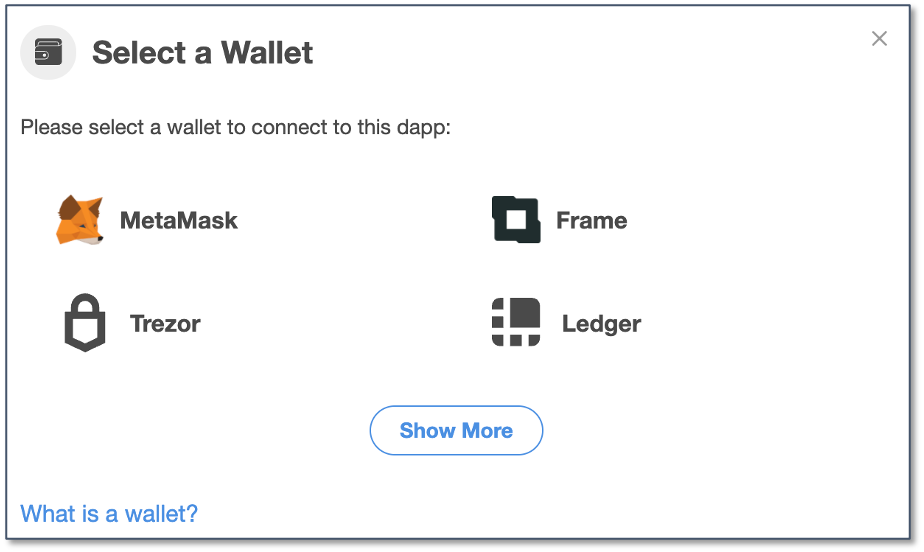
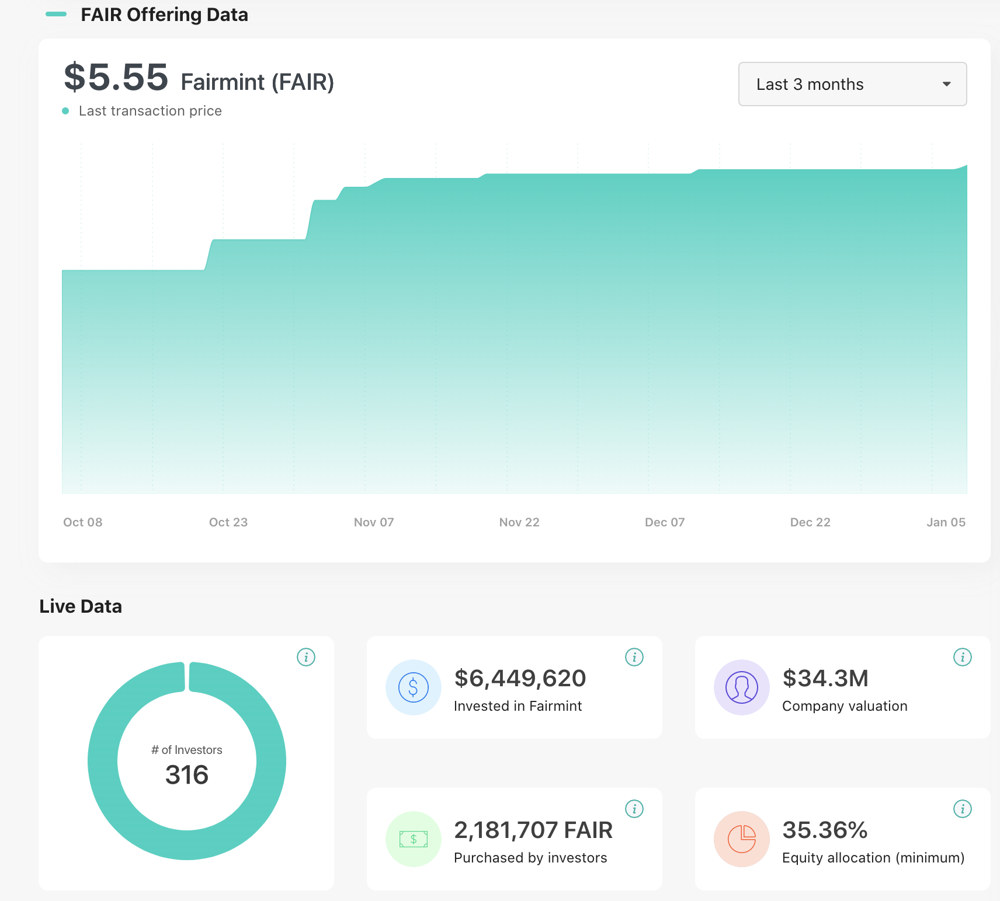
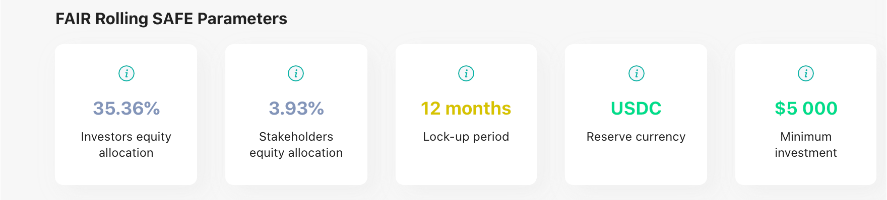

# Instruction

## Objective
* Create a DeFi (with Analytics) based modern, interactive, user-friendly, web/mobile optimized (in terms of page loading) web3 based front-end with wallet integrated.

## Features
* UI/UX: a modern, interactive, user-friendly, web/mobile optimized (in terms of page loading) web3 based front-end with wallet integrated.
* Wallets supported: Metamask, Frame, Trezor, Ledger.

## Task
* Create a similar or better front-end like shown below:

* All the data can be static.
* Host the page on a url using cloud services like Heroku, Google cloud, Amazon AWS, etc.

## Dependencies
* `web3js`
* `ether`

## Networks
* Localhost
* Testnet
	- Rinkeby
	- Kovan
* Mainnet
	- Ethereum

## Examine
* Skill of creating a modern, interactive, user-friendly, web/mobile optimized (in terms of page loading) web3 based front-end with wallet integrated.
* Wallet integration like Metamask, Frame, Trezor, Ledger.
* Should follow the industry web3 front-end standards.

## Glossary
